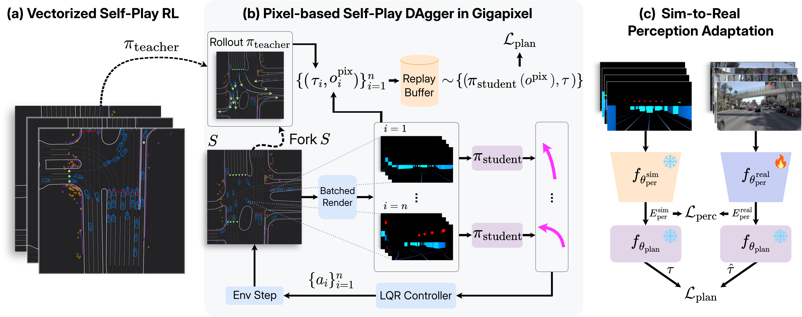
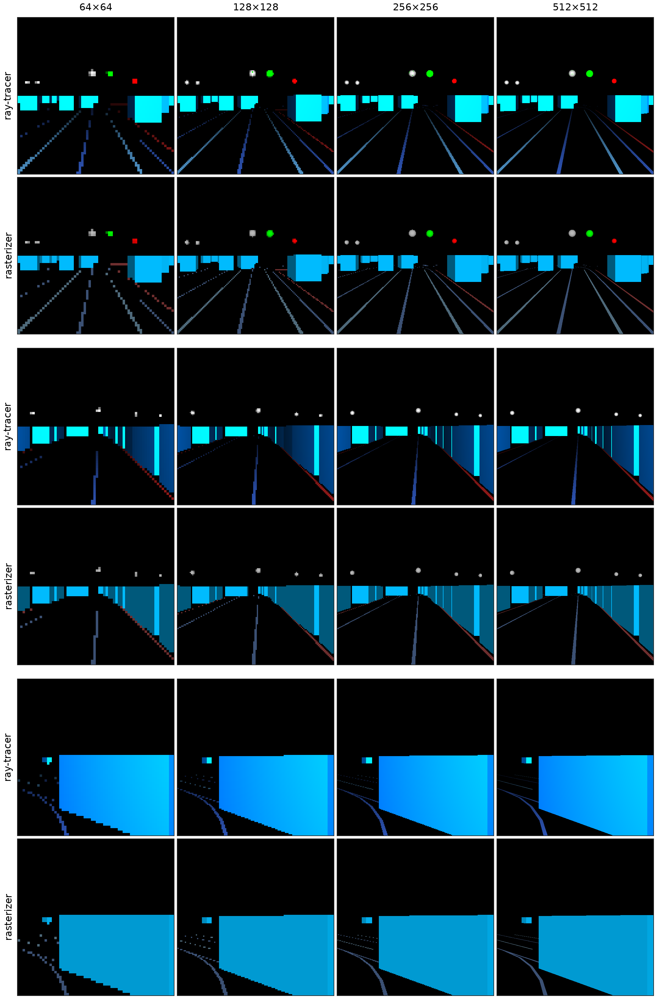
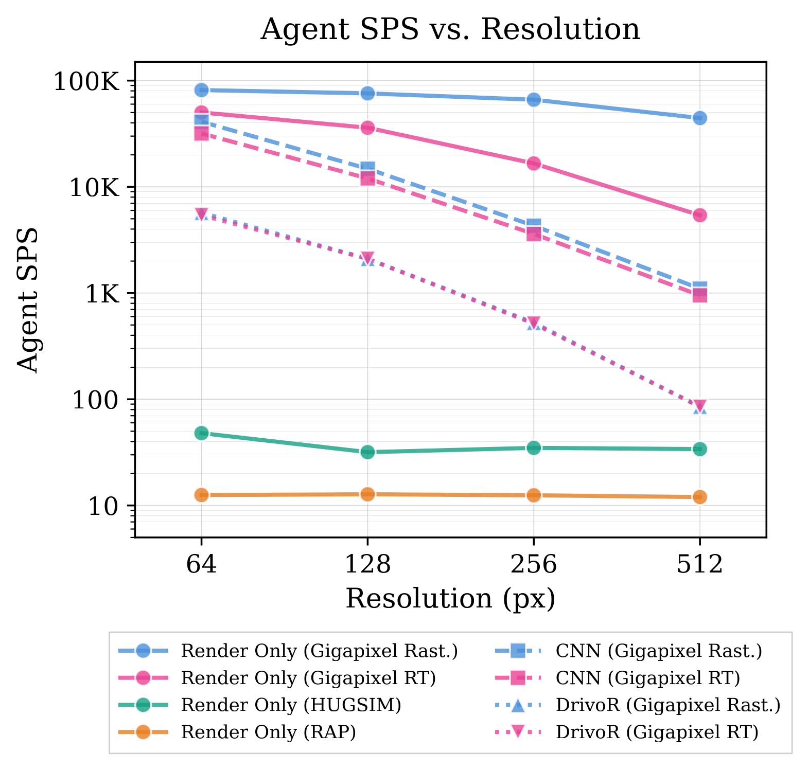
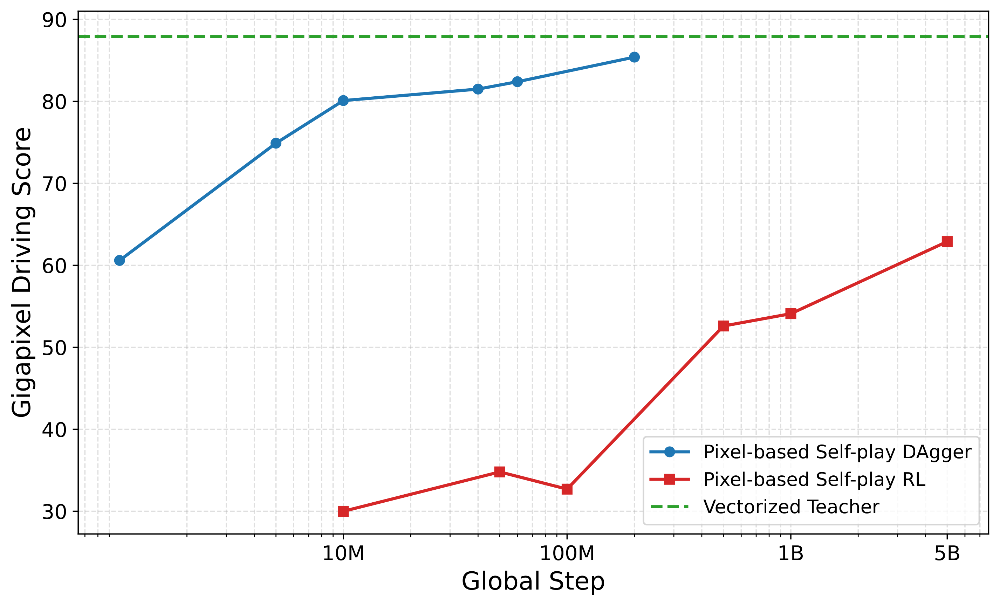
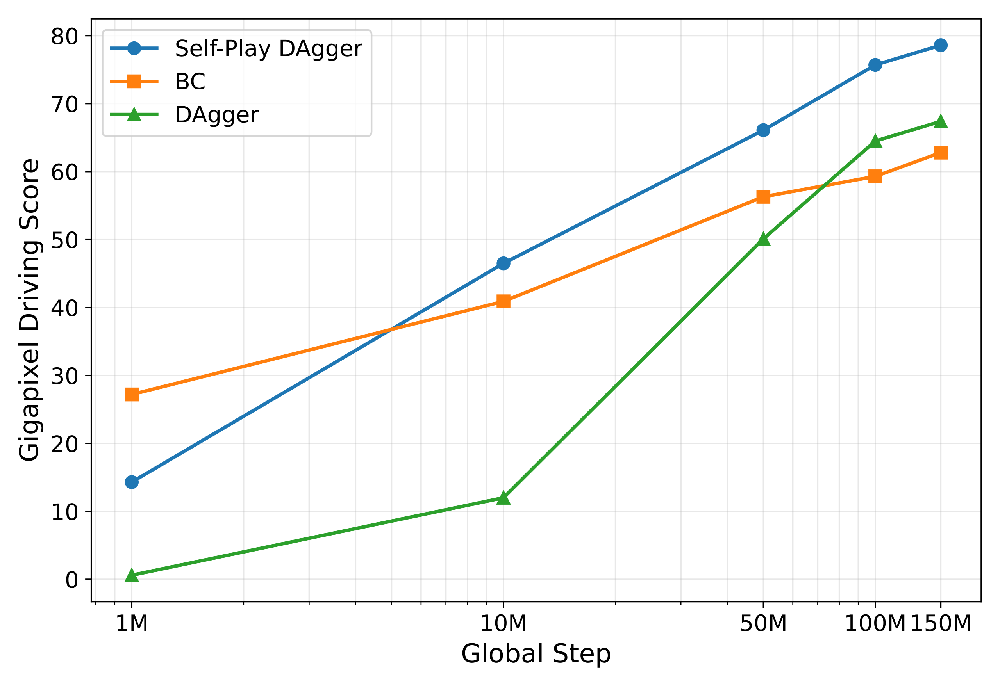

<!-- ===================== OVERVIEW VIDEO ===================== -->
<section class="section section--alt" id="overview">
  

    

      <h2>Video Overview</h2>
    

    

      <video controls preload="none" playsinline poster="src/video_poster.jpg">
        <source src="src/video.mp4" type="video/mp4">
        Your browser does not support the video tag.
      </video>
    

  

</section>

<!-- ===================== METHOD / SYSTEM FIGURE ===================== -->
<section class="section" id="method">
  

    

      Method
      <h2>Self-Play for End-to-End Driving</h2>
    

    <figure class="media media--pad fig fig--wide reveal">
      
      <figcaption><b>Overview.</b> <b>(a) Vectorized teacher.</b> A compact policy is trained with self-play reinforcement learning over fast vectorized BEV observations, yielding a robust, naturalistic driving policy. <b>(b) Pixel-based student (self-play DAgger).</b> The teacher is distilled into a pixel-based end-to-end policy inside Gigapixel. Every agent in the scene is controlled by the student, and at each visited state a <i>forked</i> parallel simulator rolls out the teacher to generate per-agent trajectory targets. <b>(c) Sim-to-real perception adaptation.</b> To deploy on real sensor observations, we freeze the planning head and finetune only the perception backbone on paired simulated&ndash;real observations, mapping real images into the latent representation the planning head already acts on.</figcaption>
    </figure>

    

      <b>Why self-play?</b> Behavior cloning learns from a fixed, narrow distribution of human logs and never sees the consequences of its own actions, so errors compound in closed-loop. In self-play, agents are paired with copies of themselves and learn through closed-loop interaction, which surfaces safety-critical interactions that are vanishingly rare in driving logs, and exposes the policy to the consequences of its own actions during training.
    

  

</section>

<!-- ===================== GIGAPIXEL SIMULATOR ===================== -->
<section class="section section--alt" id="simulator">
  

    

      Simulator
      <h2>The Gigapixel Renderer</h2>
      
Gigapixel extends the PufferDrive batched simulator with the GPU-accelerated Madrona renderer, exposing ego-centric perspective views rather than only vectorized BEV features. It renders a deliberately simple bounding-box world (vehicles and static objects as cuboids, lane polylines as thin planar strips, and traffic lights as small spheres) preserving the scene geometry and interaction fidelity needed for planning while sustaining <strong>50k agent steps per second on a single GPU, scaling near-linearly with the number of GPUs</strong>.

    

    <!-- Rollouts -->
    <h3 class="reveal" style="text-align:center;margin-bottom:6px">Gigapixel Rollouts</h3>
    
The ego-centric pixel observations a policy receives during self-play, stitched across the forward camera views. Blue cuboids are surrounding agents, thin strips are lane polylines, and the small colored spheres are traffic lights.

    

      

        <video class="autoplay" muted loop playsinline preload="none" poster="src/gigapixel_rollouts/world_0013.jpg">
          <source src="src/gigapixel_rollouts/world_0013.mp4" type="video/mp4">
        </video>
      

      

        <video class="autoplay" muted loop playsinline preload="none" poster="src/gigapixel_rollouts/world_0030.jpg">
          <source src="src/gigapixel_rollouts/world_0030.mp4" type="video/mp4">
        </video>
      

    

    <!-- Rasterizer vs Ray Tracer -->
    

      

        <figure class="media media--pad">
          
        </figure>
      

      

        <h3>Two Rendering Backends</h3>
        
Gigapixel supports rasterized and ray-traced rendering. The rasterizer is faster, exploiting the simplicity of the primitives; the ray tracer trades throughput for higher visual fidelity, which is visible in the richer shading of the lower rows.

      

    

    <!-- Throughput -->
    

      

        <figure class="media media--pad">
          
        </figure>
      

      

        <h3>Throughput vs. Resolution</h3>
        
Agent steps per second (SPS) across rendering resolutions and policy architectures on one NVIDIA A100 GPU. <em>Render Only</em> isolates renderer throughput, with no policy forward or backward pass.

        <ul>
          <li>The Gigapixel rasterizer is <strong>~1000&times; faster</strong> than the Gaussian-splatting HUGSIM renderer and <strong>~4000&times; faster</strong> than the CPU rasterizer RAP at 512&times;512.</li>
          <li>The gap between the rasterizer (Rast.) and ray tracer (RT) <strong>narrows as model complexity grows</strong> (CNN &rarr; DrivoR). This confirms that with a heavy end-to-end model, the renderer is no longer the throughput bottleneck.</li>
        </ul>
      

    

  

</section>

<!-- ===================== RESULTS ===================== -->
<section class="section" id="results">
  

    

      Results
      <h2>Self-Play vs. Behavior Cloning</h2>
      
We compare two pixel-based DrivoR policies driving closed-loop in photorealistic reconstructed real-world scenes. Both share the same architecture; only the training signal differs.

    

    

      <i class="g"></i>Self-Play Trained (trained in Gigapixel; adapted to real observations)
      <i class="r"></i>BC Trained (human logs)
      <i class="y"></i>Planned Trajectory
    

    

      
      

        

          Scenario {{ i }}
          Same scene &middot; two policies
        

        

          Self-Play Trained
          <video class="autoplay" muted loop playsinline preload="none" poster="src/gigapixel_versus_drivor_{{ i }}/poster_gigapixel.jpg">
            <source src="src/gigapixel_versus_drivor_{{ i }}/web_gigapixel.mp4" type="video/mp4">
          </video>
        

        

          BC Trained
          <video class="autoplay" muted loop playsinline preload="none" poster="src/gigapixel_versus_drivor_{{ i }}/poster_drivor.jpg">
            <source src="src/gigapixel_versus_drivor_{{ i }}/web_drivor.mp4" type="video/mp4">
          </video>
        

      

      
    

    

      <b>What to look for.</b> The self-play policy anticipates hazards: it reduces speed and plans smooth corrective maneuvers (e.g., yielding to a decelerating lead vehicle or steering back from the road edge). The behavior-cloned policy, never exposed to the consequences of its own actions, tends to keep a centered, high-velocity straight-ahead plan and fails in the rare safety-critical situations that precede a stop or a recovery (rear-ending a stopped vehicle or drifting off-road). On HUGSIM, the average collision velocity of the self-play policy is 1.95 m/s versus 5.27 m/s for behavior cloning, a 2.7&times; reduction.
    

    <!-- Sample efficiency -->
    

      

        <figure class="media media--pad">
          
        </figure>
      

      

        <h3>Self-Play DAgger is More Sample-Efficient than Self-Play RL</h3>
        
Using a lightweight CNN policy (for tractable RL experimentation), we compare distilling a privileged teacher via self-play DAgger against training the pixel policy directly with self-play RL.

        <ul>
          <li>Self-play DAgger surpasses a Gigapixel Driving Score of 60 in roughly <strong>3000&times; fewer steps</strong> than self-play RL.</li>
          <li>It quickly approaches the vectorized teacher's performance (dashed line, reached at 25B steps).</li>
          <li>This motivates distilling an RL teacher rather than training a large pixel policy with RL from scratch.</li>
        </ul>
      

    

    <!-- Scaling -->
    

      

        <figure class="media media--pad">
          
        </figure>
      

      

        <h3>Scaling Self-Play</h3>
        
Closed-loop performance of the DrivoR-Reg student as training experience scales in Gigapixel, across three end-to-end training strategies.

        <ul>
          <li>Self-play DAgger <strong>improves consistently with scale</strong> and overtakes both single-agent DAgger and behavior cloning beyond 10M steps.</li>
          <li>Behavior cloning plateaus around 100M steps, as the student is never exposed to consequences of its own actions.</li>
          <li>Self-play's edge comes from two effects: <strong>every</strong> agent in a rollout contributes supervised data, and the co-evolving interactions span more diverse, safety-critical states.</li>
        </ul>
      

    

    

      <b>Headline results.</b> Gigapixel-DrivoR reaches <strong>state-of-the-art</strong> on the closed-loop HUGSIM benchmark (38.5 HD-Score, 50.1 route completion) and competitive performance on NAVSIM-v2, <strong>without human trajectory supervision</strong>. Scaling self-play yields proportional gains in policy performance.
    

  

</section>

<!-- ===================== CITATION ===================== -->
<section class="section section--alt" id="citation">
  

    

      Citation
      <h2>BibTeX</h2>
      
If you find this work useful, please consider citing it.

    

    

      <button class="copybtn" id="copy-bibtex" type="button">Copy</button>
      <pre id="bibtex-code">@article{rowe2026gigapixel,
  title   = {Scaling Self-Play for End-to-End Driving},
  author  = {Rowe, Luke and Girgis, Roger and de Schaetzen, Rodrigue and
             Cornelisse, Daphne and Grandhi, Alaap and Heide, Felix and
             Vinitsky, Eugene and Pal, Christopher and Paull, Liam},
  journal = {arXiv preprint arXiv:2606.19641},
  year    = {2026}
}</pre>
    

  

</section>
